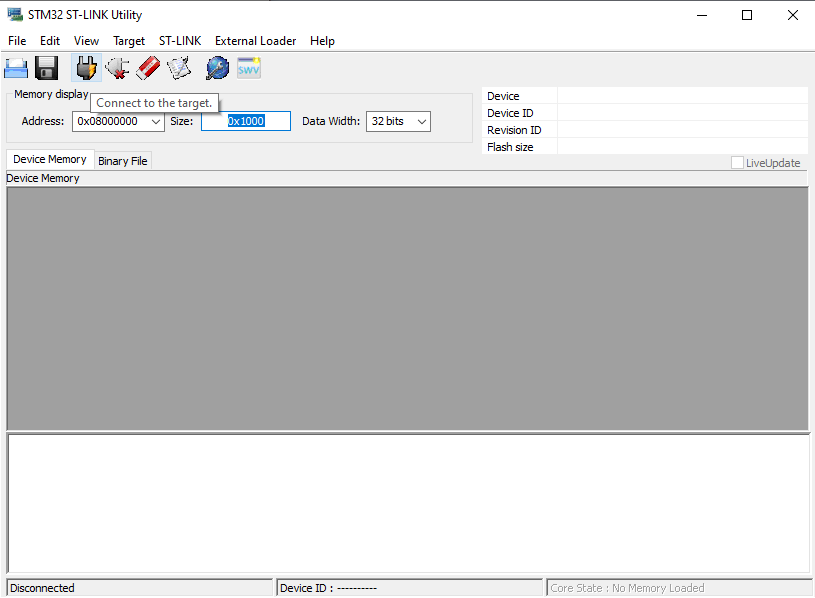
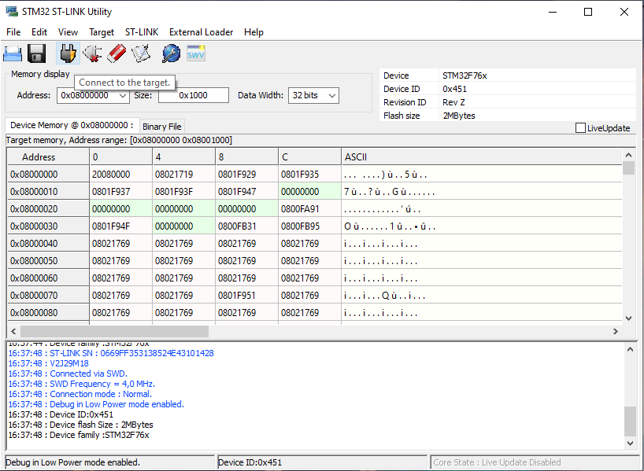
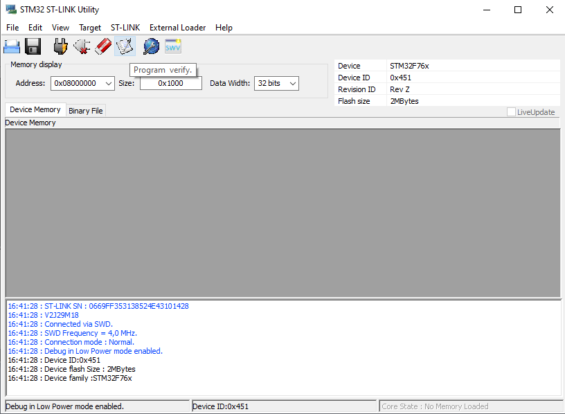
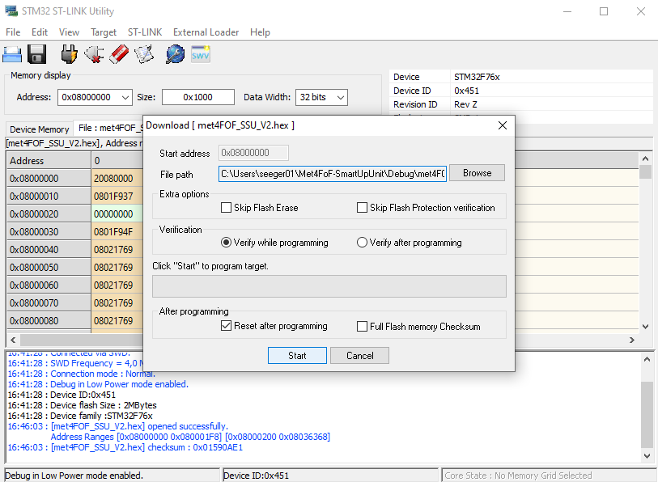

### Flash STM32 Firmware on Met4FoF Smartup unit
1. Download and Install [ST-Link Software](https://www.st.com/en/development-tools/stsw-link004.html)
2. Connect Baord to PC with u-USB cabel on Connector USB PWR (the connector on the smaller white Part of the Board).
3. Start St-Link software.
4. Connect to the target.

Successful connection.

 5. Chosse the programming option.

Download the latest .hex file from the [releases section](https://github.com/Met4FoF/Met4FoF-SmartUpUnit/releases) of this repo.

